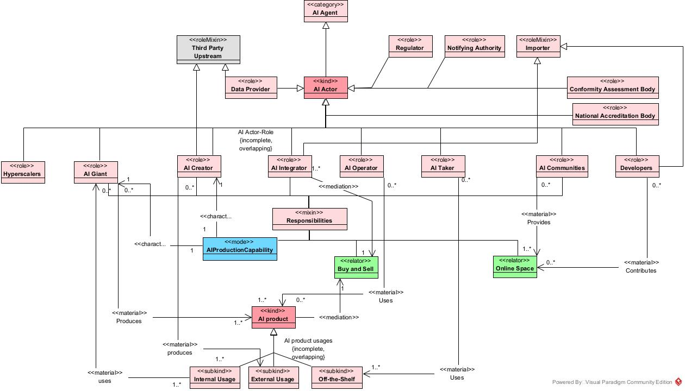
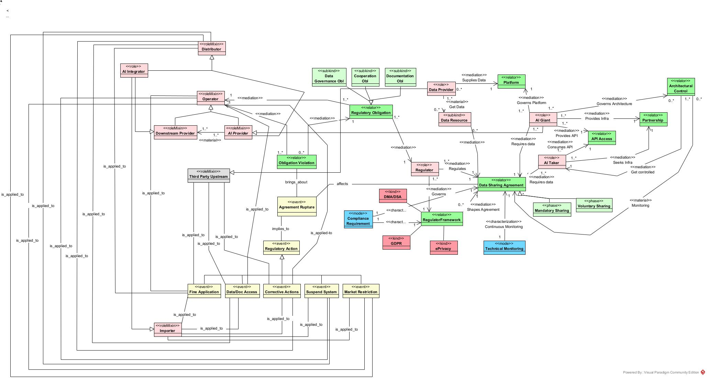
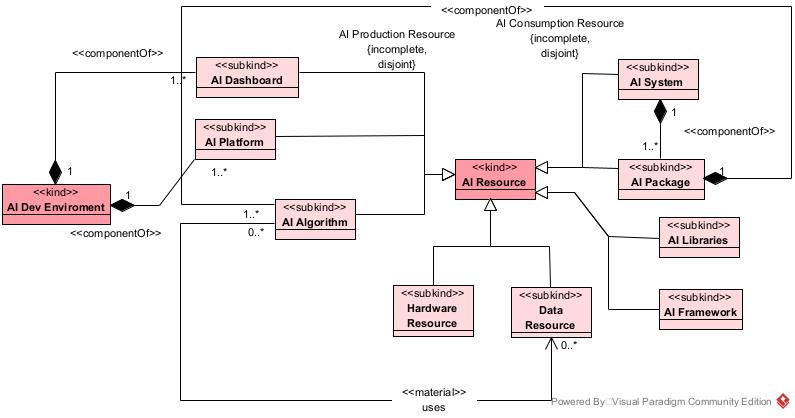
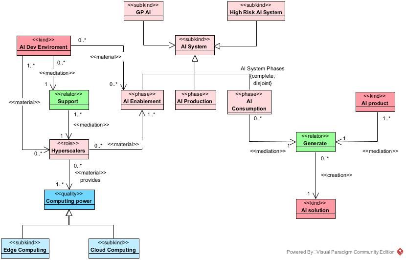
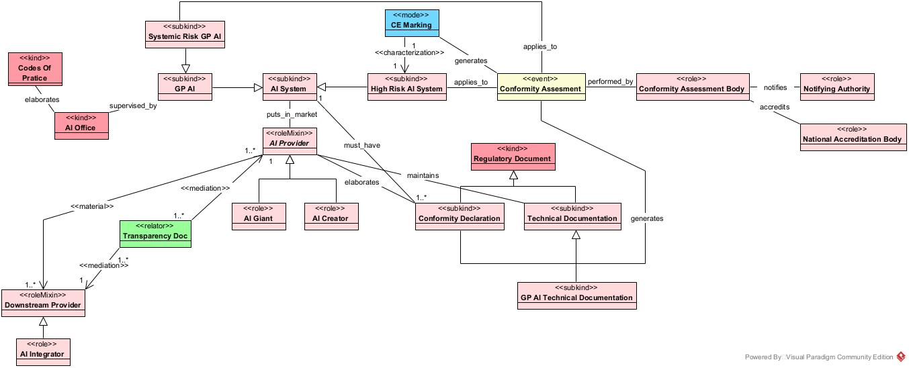

# Ontologia do Ecossistema de IA

## Estrutura

- **[images/agent_view.png](./images/agent_view.png):** Diagrama de classes focado nos atores do ecossistema de IA.
- **[images/agreement_view.jpg](./images/agreement_view.jpg):** Diagrama de classes focado no acordo de compartilhamento de dados.
- **[images/ai_resource_view.jpg](./images/ai_resource_view.jpg):** Diagrama de classes focado nos recursos de IA.
- **[images/ai_system_view.jpg](./images/ai_system_view.jpg):** Diagrama de classes focado no conceito do sistema de IA.
- **[images/certification_view.jpg](./images/certification_view.jpg):** Diagrama de classes focado nos processos de certificação e acreditação.
- **[Projeto_-_Ontologia_de_Ecossistema_de_IA.vpp](./Projeto_-_Ontologia_de_Ecossistema_de_IA.vpp):** Projeto desenvolvido com o Visual Paradigm que contém a modelagem das views.
- **[ai-ecosystem.ttl](./ai-ecosystem.ttl):** Arquivo da ontologia em formato Turtle.

## ORSD

### Propósito
O propósito principal da ontologia é modelar formalmente a estrutura institucional, regulatória e de governança do Ecossistema de Inteligência Artificial, com ênfase nas relações de responsabilidade, conformidade e fluxo de dados. A ontologia deve servir como uma ferramenta de referência e análise para: mapear as partes envolvidas; formalizar a conformidade e a governança; estruturar a dinâmica de dados e acordos.

### Escopo
O escopo da ontologia será delimitado pela necessidade de responder às suas questões de competência (CQs), utilizando os conceitos estruturais fornecidos pelos documentos de referência.
A ontologia modelará:
- Atores Essenciais: AI Giant, AI Creator, AI Integrator, AI Operator, AI Taker, etc.;
- Ciclo de Vida da IA e Componentes: As etapas de Habilitação (Enablement), Produção (Production), e Consumo (Consumption) da IA, assim como conceitos de Sistemas de IA de Alto Risco (High-Risk AI Systems) e Modelos de IA de Propósito Geral (General-Purpose AI Models);
- Requisitos e Conformidade: Conceitos como Avaliação de Conformidade (Conformity Assessment), Documentação Técnica (Technical Documentation) ou Ação Regulatória (Regulatory Action).
- Relações Jurídico-Contratuais: Acordos e consequências como Acordo de Compartilhamento de Dados (Data Sharing Agreement) ou Obrigação Regulatória (Regulatory Obligation).
Devido à maior quantidade de documentação de referência foi adotada uma abordagem que se concentra nos conceitos e estruturas do quadro regulatório da União Europeia (AI Act).

### Linguagem de Implementação
Ontology-based Unified Modeling Language (OntoUML).

### Usuários-Finais Pretendidos
**Usuário 1:** Autoridades Reguladoras e Fiscais

**Usuário 2:** Oficiais de Conformidade

**Usuário 3:** Consultores Jurídicos

**Usuário 4:** Arquitetos de Dados e Segurança

**Usuário 5:** Pesquisadores Acadêmicos

### Usos Pretendidos
**Uso 1:** Permitir a identificação e classificação formal dos principais AI Actors envolvidos em um determinado AI System.

**Uso 2:** Evidenciar as responsabilidades regulatórias específicas que recaem sobre um AI Actor de um sistema.

**Uso 3:** Auxiliar na avaliação preliminar de um High Risk AI System para determinar a necessidade de Conformity Assessment e a geração de Technical Documentation.

**Uso 4:** Rastrear a relação entre o Conformity Assessment Body e a Notifying Authority para validar a acreditação e o processo de certificação do sistema.

**Uso 5:** Facilitar a criação de um modelo de Data Sharing Agreement entre um AI Giant e um AI Taker.

**Uso 6:** Dada uma Agreement Rupture, identificar imediatamente o Operator sobre o qual as Regulatory Actions devem ser aplicadas.

**Uso 7:** Fornecer aos reguladores (Regulators) o caminho lógico e formal que justifica a aplicação de Regulatory Action.

### Requisitos Não Funcionais
**RNF1:** A ontologia deve descrever como um ecossistema de IA e seus componentes funcionam.
**RNF2:** Deve ser modular, permitindo que seus componentes possam ser reutilizados em outras ontologias.
**RNF2:** Documentação em um repositório do github.

### Requisitos Funcionais
**RF1:** Quais são os atores e suas respectivas responsabilidades em um ecossistema de IA?

**RF2:** Como ocorrem a certificação e a acreditação de atores de um ecossistema de IA?

**RF3:** Como um acordo de compartilhamento ou transferência de dados sensíveis é formado em um ecossistema de IA?

**RF4:** Como um acordo desse tipo é monitorado?

**RF5:** Quais ações se aplicam a quais atores em caso de ruptura de acordo de compartilhamento de dados?

## Views Overview

#### View dos Agentes de IA e suas responsabilidades:

#### View dos acordos de compartilhamento de dados, mostrando como são monitorados e também quais são as ações que se aplicam aos atores em caso de ruptura do acordado:

#### View de como os recursos de IA se relacionam:

#### View que demonstra cada etapa de um sistema de IA: 

#### View que mostra como é feito a acreditação e certificação dos atores do ecossistema de IA:

## Desenvolvedores

- <a href="https://github.com/eduardoaquinosilva">Eduardo Aquino</a>
- <a href="https://github.com/ratelp">Rafael Martinho</a>

## Referências
- [The evolutionary dynamics of the artificial intelligence ecosystem](https://doi.org/10.1287/stsc.2021.0148)
- [Regulation (EU) 2024/1689 of the European Parliament and of the Council of 13 June 2024 laying down harmonised rules on artificial intelligence (Artificial Intelligence Act)](http://data.europa.eu/eli/reg/2024/1689/oj)
